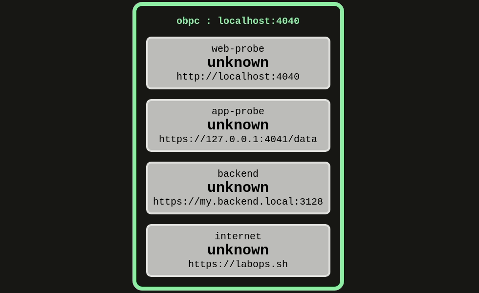

# `probe`

`probe` is an API service that performs active healthchecks of any `http/https` service.  
It provides a UI of status tiles to provide real-time visualisation of configured probes.  
Suitable for quickly validating microservice health or configured firewall rules.  



Probes can be configured via either the included **CLI** or the REST **API**.  

## TLDR; Install
### via Docker: Shell Integration
Builds a shell command that links to the docker container.  
Requires docker installed on your system.  

```
docker run apnex/probe shell > probe-cli
chmod +x probe-cli
mv probe-cli /usr/bin/
```

#### [OPTIONAL] set server listening port
`PROBE_SERVER_PORT` is the server listening TCP port  
Defaults to `4040` if not specified
```
export PROBE_SERVER_PORT=4040
```

Once shell integration installed, `probe` can be controlled directly via the `probe-cli` shell command.  
See **Usage** below  

### via Docker run: [Manual]
This is where we manually start the container using `docker run`  
This is not required if you have performed **Shell Integration**   
Subsequent commands are then issued using `docker exec` commands.  

Start the container in background:
```
docker run -d -P --net host \
	--name probe \
	-e PROBE_SERVER_PORT=4040 \
apnex/probe
```

NOTE: It is preferable to use `--net host` so that the UI reports the correct hostname of the server  

**Where:**  
- `PROBE_SERVER_PORT` is the server listening TCP port. Defaults to `4040` if not specified  

Then issue one or more `docker exec` commands:
```
docker exec -t probe cli <cmd>
```

Clean up docker container when done:
```
docker rm -f probe
```

## PROBE TYPES
#### HTTP / HTTPS
Generates a HTTP HEAD request to the configured probe endpoint  
Default polling interval = `5 seconds`  
Default retries on failure = `2`  
  
## USAGE
`probe` includes a CLI for terminal access to probe configuration  
The following examples assume you have configured **Shell Integration**  
If you are using `docker exec` - append the `<cmd>` to the  `docker exec -t probe cli` command  

**CLI** format is `probe-cli <cmd>`  
**API** examples use **CURL + JQ** and assume server listening at `locahost:4040`  

---
#### `list`
Get available commands  
```
probe-cli list
```

#### `probes.create`
Create a new probe  
```
probe-cli probes.create probe0 https://labops.sh
```

API
```shell
read -r -d "" BODY <<EOF
{
	"name": "probe0",
	"endpoint": "https://labops.sh"
}
EOF
curl -s -X POST \
	-H "Content-Type: application/json" \
	-d "${BODY}" \
http://localhost:4040/probes
```

#### `probes.list`
List all probes  
```
probe-cli probes.list
```

API
```shell
curl -s http://localhost:4040/probes | jq --tab .
```

#### `probes.get`
Get a specific probe  
```
probe-cli probes.get probe0
```

API
```shell
curl -s http://localhost:4040/probes/probe0 | jq --tab .
```

#### `probes.delete`
Delete an existing probe  
```
probe-cli probes.delete probe0
```

API
```shell
curl -s -X DELETE http://localhost:4040/probes/probe0
```

#### `stop`
Stops the server  
```
probe-cli stop
```
