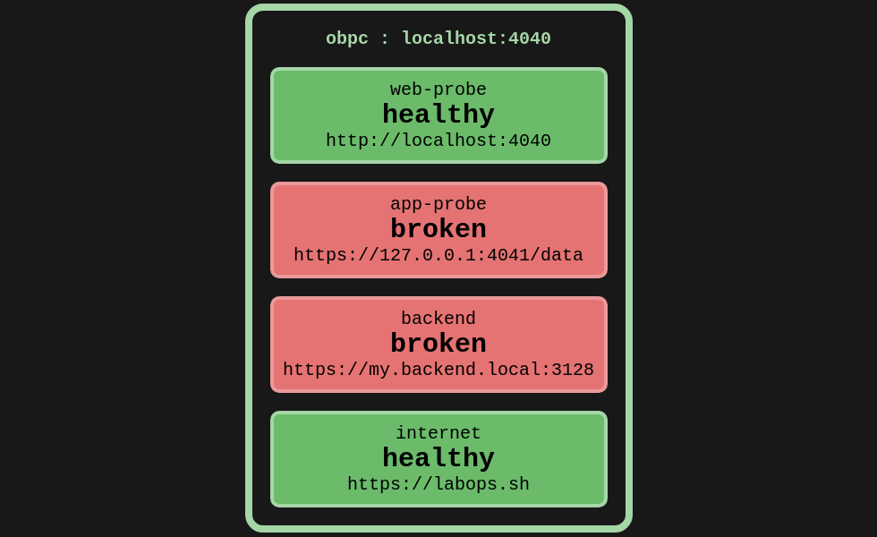

# `probe`

`probe` is an API service that performs active healthchecks of any `http/https` service.  
It provides a UI of configured tiles to provide real-time visualisation of configured probes.  
Suitable for for quickly validating microservice health or configured firewall rules.  



Probes can be configured either directly via the provided REST API or the included CLI.  

## TLDR; Install
### via Docker: Shell Integration
Builds a shell command that links to the docker container.  
Requires docker installed on your system.  

```
docker run apnex/probe shell > probe-cli
chmod +x probe-cli
mv probe-cli /usr/bin/
```

#### [OPTIONAL] set server listening port
`PROBE_SERVER_PORT` is the server listening tcp port  
Defaults to `4040` if not specified
```
export PROBE_SERVER_PORT=4040
```

Once shell integration installed, `probe` can be controlled directly via the `probe-cli` shell command.  
See **Usage** below  

### via Docker run: [Manual]
This is where we manually start the container using `docker run`  
This is not required if you have performed **Shell Integration**   
Subsequent commands are then issued using `docker exec` commands.  

Start the container in background:
```
docker run -d -P --net host \
	--name probe \
	-e PROBE_SERVER_PORT=4040 \
apnex/probe
```

NOTE: It is preferable to use `--net host` so that the UI reports the correct hostname of the node  

**Where:**  
- `PROBE_SERVER_PORT` is the server listening tcp port. Defaults to `4040` if not specified  

Then issue one or more `docker exec` commands:
```
docker exec -t probe <cmd>
```

Clean up docker container when done:
```
docker rm -f probe
```
